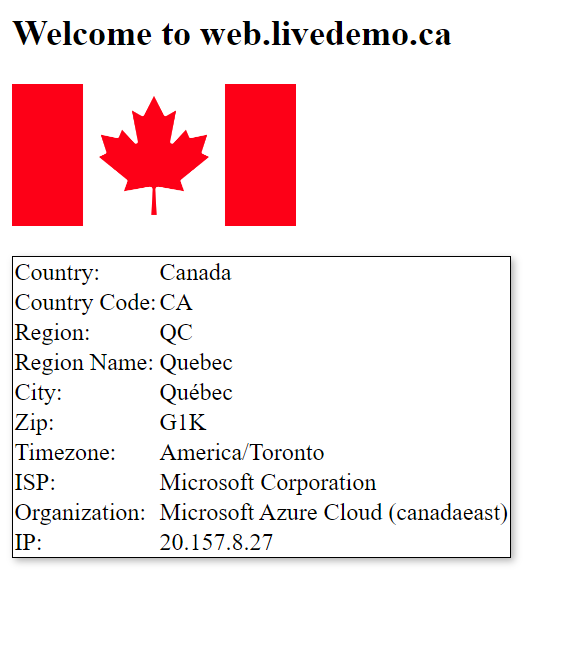

# Simple Dynamic Web App

This repository contains a simple, dynamic Node.js web application that serves a home page running on port 3000. When visited, the home page provides:

- A welcome message
- A display of the flag corresponding to the location of the server's IP address
- A detailed table presenting various geographic and ISP-related information about the server's current location

All data is derived in real-time from the IP Geolocation API.

## How It Works

The application is set up to handle HTTP GET requests to the root URL (http://localhost:3000/). Upon receiving a GET request, the application makes an axios HTTP GET request to `http://ip-api.com/json`, a third-party IP Geolocation API.

Using the response from this API, the application dynamically constructs an HTML response. This response includes:

- A welcome message
- An image of the country's flag associated with the country code obtained from the API (The flag image is fetched from `https://flagpedia.net/data/flags/normal/`)
- A table displaying comprehensive location and ISP information (Country, Country Code, Region, Region Name, City, Zip code, Timezone, ISP, Organization, IP)

The Express server starts listening for requests on port 3000 and logs a success message to the console once it's up and running.

## Build and Run

To build a Docker image from the Dockerfile provided, navigate to the directory containing the Dockerfile and execute:

```bash
docker build -t my-web-app .
```

To run the application:

```bash
docker run -p 3000:3000 -d my-web-app
```

After running these commands, visit `http://localhost:3000` to see the application in action.

## Example



