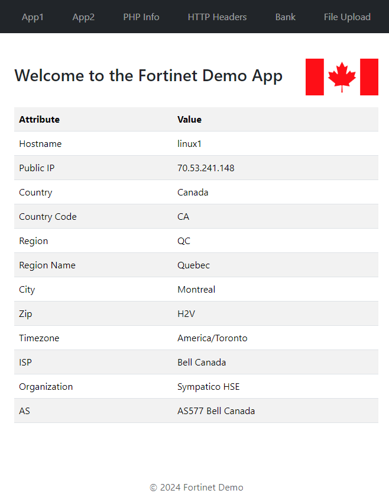

# Simple Dynamic Web App for Demo (WAF / ADC)

This repository contains a simple, dynamic web application that serves a home page running on port 2000. When visited, the home page provides:

- A welcome message
- A display of the flag corresponding to the location of the server's IP address
- A detailed table presenting various geographic and ISP-related information about the server's current location

All data is derived in real-time from the IP Geolocation API.

## How It Works

The application is set up to handle HTTP GET requests to the root URL (http://localhost:2000/). Upon receiving a GET request, the application makes an HTTP GET request to `http://ip-api.com/json`, a third-party IP Geolocation API.

Using the response from this API, the application dynamically constructs an HTML response. This response includes:

- A welcome message
- An image of the country's flag associated with the country code obtained from the API (The flag image is fetched from `https://flagpedia.net/data/flags/normal/`)
- A table displaying comprehensive location and ISP information (Country, Country Code, Region, Region Name, City, Zip code, Timezone, ISP, Organization, IP)

## Build and Run

To build and run the Docker image from the Dockerfile provided, navigate to the directory containing the Dockerfile and execute:

```bash
git clone https://github.com/benoitbMTL/web-app.git
cd web-app
docker build -t demo-web-app .
docker run -d --restart unless-stopped --name demo-web-app -p 2000:80 -e HOST_MACHINE_NAME=$(hostname) benoitbmtl/demo-web-app
```

After running these commands, visit `http://localhost:2000` to see the application in action.

## Example



